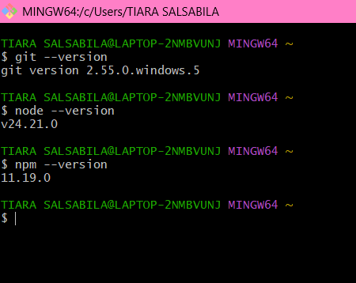
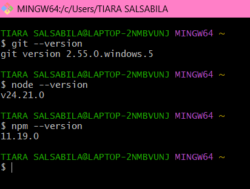
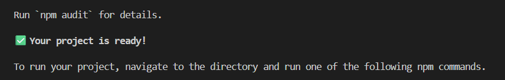
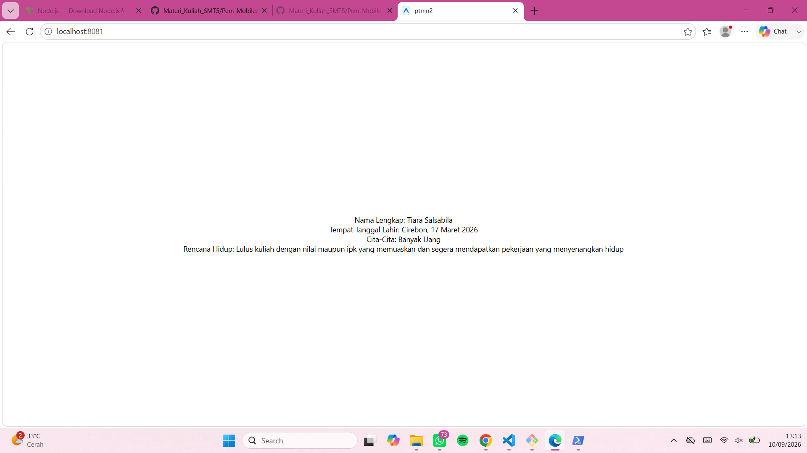

# **Prakikum Menyiapkan Memulai Pemrograman Mobile dengan React Native**

## **Tujuan pembelajaran**
Setelah menyelesaikan modul praktikum ini, mahasiswa diharapkan mampu:
- Menginstal Git dan Github 
- Menginstal Node.Js dan NPM
- Menginstal Expo CLI
- Membuat project React Native
- Menjalanlan project React Native

1. Instal Git di Local
    - unduh dan instal Git Via [https://git-scm.com/install/windows]
    - Verifikasi Git (buka cmd dan ketik "cmd --version")
    
    

2. Instal Node Js
    - unduh dan instal Node Js Via [https://nodejs.org/en/download]
    - Verifikasi Node JS (buka cmd dan ketik "node --version" "npm --version")

    

3. Memulai Project dengan Framework Expo 
    - Buka terminal pada code editor
    - Pastikan aktif di directory yang dituju 
    - Ketikan (npx create-exp-app ptmn2 --template blank)
    - Tunggu hingga proses intalasi selesai
    - Project selesai

    

4. Menjalankan Project React Native
    - Masuk ke directory projek (cd ptmn 2)
    - Jalankan projek (npx expo start)
    - scan qr code dengan aplikasi Expo Go
    - Jika ingin run emulator di WEB ketik w 
    - diterminal "npx expo install react-dom react-native-web"
    - npx expo start --web

    