# MODUL PRAKTIKUM 4: Navigasi di React Native

## A. Tujuan Pembelajaran

Setelah menyelesaikan praktikum ini, mahasiswa diharapkan mampu:

1. Memahami konsep dan mekanisme perpindahan layar (*routing*) pada aplikasi *mobile*.  
2. Melakukan instalasi dan konfigurasi pustaka `React Navigation`.  
3. Mengimplementasikan **Stack Navigation** untuk alur layar linier.  
4. Mengimplementasikan **Tab Navigation** untuk menu pintasan bawah.  
5. Mengimplementasikan **Drawer Navigation** untuk menu panel samping.

---

## B. Persiapan Lingkungan (Environment Setup)

Sebelum memulai praktikum, pastikan Anda telah membuat *project* Expo baru. Buka terminal/CMD Anda, dan jalankan perintah instalasi dasar untuk React Navigation:

```sh
# 1. Install core navigation library
npm install @react-navigation/native

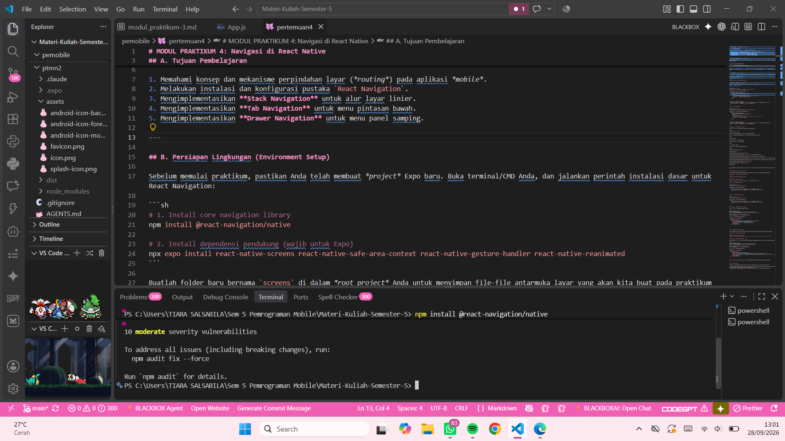

# 2. Install dependensi pendukung (wajib untuk Expo)
npx expo install react-native-screens react-native-safe-area-context react-native-gesture-handler react-native-reanimated
```
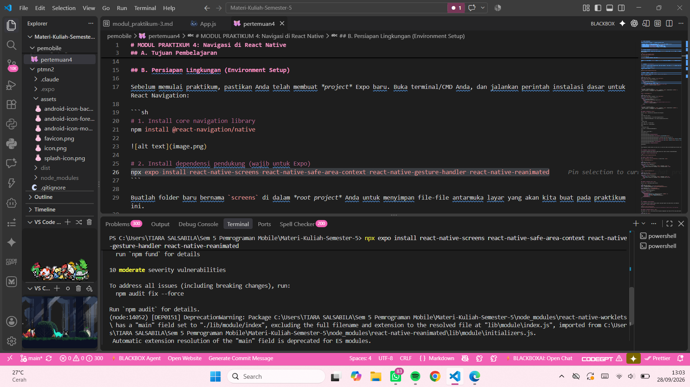

Buatlah folder baru bernama `screens` di dalam *root project* Anda untuk menyimpan file-file antarmuka layar yang akan kita buat pada praktikum ini.

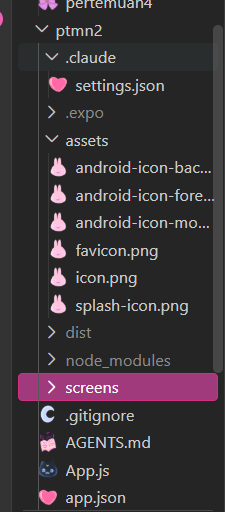

---

## C. PRAKTIKUM 1: Stack Navigation

Stack Navigation bekerja seperti tumpukan kartu. Layar baru ditumpuk di atas layar lama, dan pengguna dapat kembali ke layar sebelumnya.

### Langkah 1: Instalasi Pustaka Stack

Jalankan perintah berikut di terminal:

```sh
npm install @react-navigation/native-stack
```
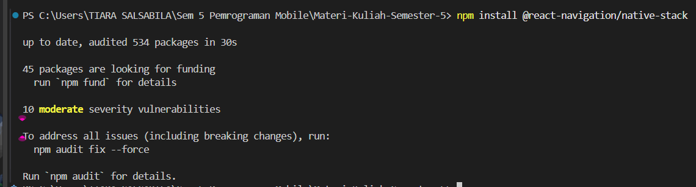

### Langkah 2: Membuat File Layar (Screens)

Buat dua file baru di dalam folder `screens`: `Login.js` dan `Signup.js`.
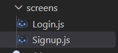

**File: `screens/Login.js`**

```js
import React from 'react';
import { View, Text, Button, StyleSheet } from 'react-native';

export default function Login({ navigation }) {
  return (
    <View style={styles.container}>
      <Text style={styles.title}>Halaman Login</Text>
      <Button 
        title="Belum punya akun? Daftar di sini" 
        // Menggunakan navigation.navigate untuk pindah ke layar Signup
        onPress={() => navigation.navigate('Signup')} 
      />
    </View>
  );
}

const styles = StyleSheet.create({
  container: { flex: 1, justifyContent: 'center', alignItems: 'center', backgroundColor: '#f8fafc' },
  title: { fontSize: 24, fontWeight: 'bold', marginBottom: 20 }
});
```
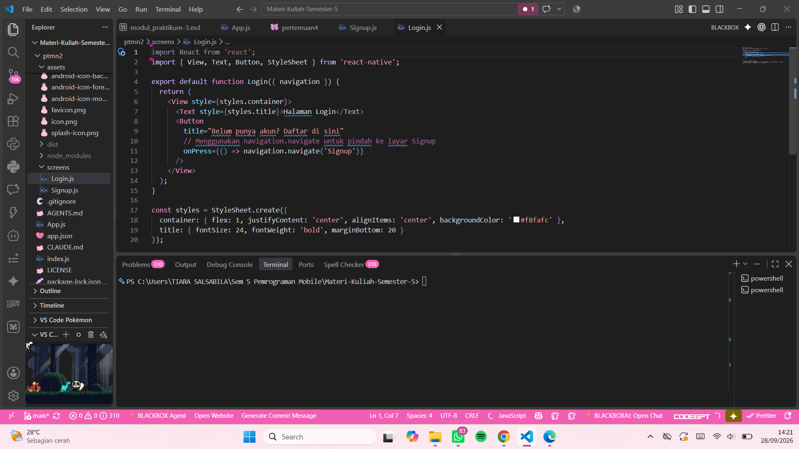

**File: `screens/Signup.js`**

```js
import React from 'react';
import { View, Text, Button, StyleSheet } from 'react-native';

export default function Signup({ navigation }) {
  return (
    <View style={styles.container}>
      <Text style={styles.title}>Halaman Sign Up</Text>
      <Button 
        title="Kembali ke Login" 
        // Menggunakan navigation.goBack() untuk membuang tumpukan layar saat ini
        onPress={() => navigation.goBack()} 
      />
    </View>
  );
}

const styles = StyleSheet.create({
  container: { flex: 1, justifyContent: 'center', alignItems: 'center', backgroundColor: '#e0f2fe' },
  title: { fontSize: 24, fontWeight: 'bold', marginBottom: 20 }
});
```
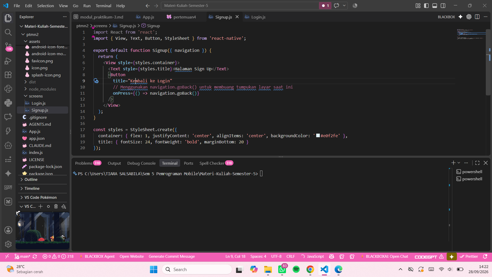

### Langkah 3: Konfigurasi di `App.js`

Buka file `App.js` utama Anda dan integrasikan Stack Navigator:

&nbsp;

import React from 'react';

import { NavigationContainer } from '@react-navigation/native';

import { createNativeStackNavigator } from '@react-navigation/native-stack';

&nbsp;

// Import Screen

import Login from './screens/Login';

import Signup from './screens/Signup';

&nbsp;

// Inisialisasi Stack

const Stack \= createNativeStackNavigator();

&nbsp;

export default function App() {

&nbsp;&nbsp;return (

&nbsp;&nbsp;&nbsp;&nbsp;\<NavigationContainer\>

&nbsp;&nbsp;&nbsp;&nbsp;&nbsp;&nbsp;\<Stack.Navigator initialRouteName="Login"\>

&nbsp;&nbsp;&nbsp;&nbsp;&nbsp;&nbsp;&nbsp;&nbsp;{/\* Daftarkan layar-layar yang ada \*/}

&nbsp;&nbsp;&nbsp;&nbsp;&nbsp;&nbsp;&nbsp;&nbsp;\<Stack.Screen name="Login" component={Login} options={{ headerShown: false }} /\>

&nbsp;&nbsp;&nbsp;&nbsp;&nbsp;&nbsp;&nbsp;&nbsp;\<Stack.Screen name="Signup" component={Signup} options={{ title: 'Daftar Akun Baru' }} /\>

&nbsp;&nbsp;&nbsp;&nbsp;&nbsp;&nbsp;\</Stack.Navigator\>

&nbsp;&nbsp;&nbsp;&nbsp;\</NavigationContainer\>

&nbsp;&nbsp;);

}

Tugas Pengecekan: Jalankan aplikasi (npx expo start). Uji coba klik tombol untuk berpindah maju dan mundur antar layar.


---

## D. PRAKTIKUM 2: Bottom Tab Navigation

Tab Navigation menampilkan menu menetap di bagian bawah layar (seperti aplikasi Instagram/WhatsApp).

### Langkah 1: Instalasi Pustaka Bottom Tabs

```sh
npm install @react-navigation/bottom-tabs
```
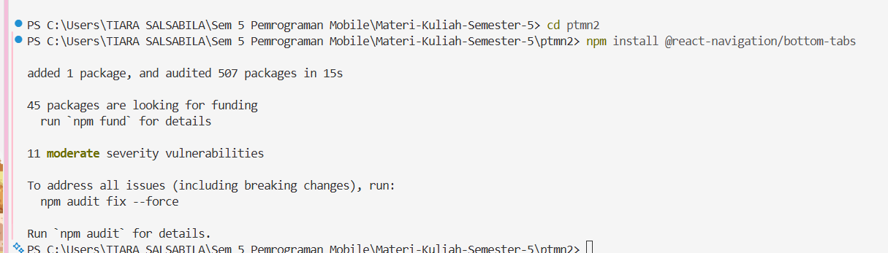

### Langkah 2: Membuat Layar Baru

Buat file `HomeScreen.js` dan `ProfileScreen.js` di dalam folder `screens`.

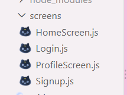

**File: `screens/HomeScreen.js`**

```js
import React from 'react';
import { View, Text } from 'react-native';

export default function HomeScreen() {
  return (
    <View style={{ flex: 1, justifyContent: 'center', alignItems: 'center' }}>
      <Text style={{ fontSize: 20, fontWeight: 'bold' }}>Halaman Beranda 🏠</Text>
    </View>
  );
}
```
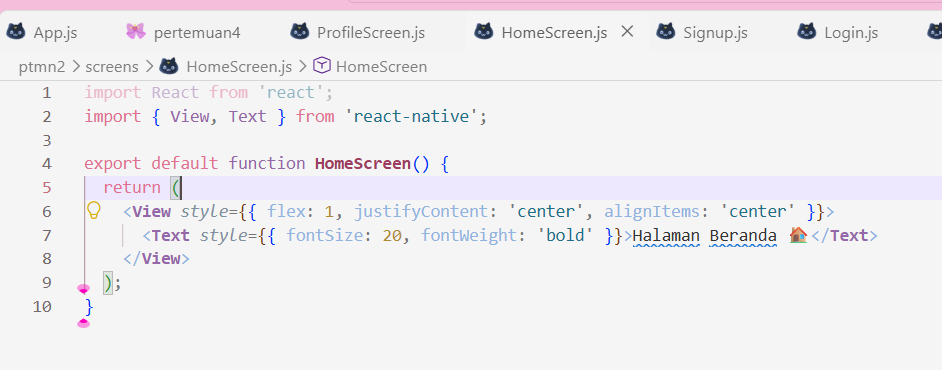


**File: `screens/ProfileScreen.js`**

```js
import React from 'react';
import { View, Text } from 'react-native';

export default function ProfileScreen() {
  return (
    <View style={{ flex: 1, justifyContent: 'center', alignItems: 'center' }}>
      <Text style={{ fontSize: 20, fontWeight: 'bold' }}>Halaman Profil 👤</Text>
    </View>
  );
}
```
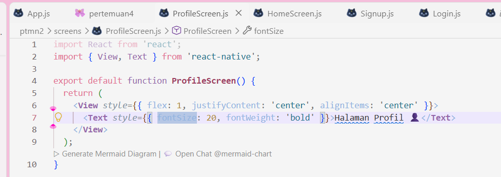

### Langkah 3: Konfigurasi Tab di `App.js`

Ubah isi `App.js` Anda menjadi seperti berikut:

```js
import React from 'react';
import { NavigationContainer } from '@react-navigation/native';
import { createBottomTabNavigator } from '@react-navigation/bottom-tabs';

import HomeScreen from './screens/HomeScreen';
import ProfileScreen from './screens/ProfileScreen';

const Tab = createBottomTabNavigator();

export default function App() {
  return (
    <NavigationContainer>
      <Tab.Navigator screenOptions={{ tabBarActiveTintColor: '#0284c7' }}>
        <Tab.Screen name="Home" component={HomeScreen} />
        <Tab.Screen name="Profile" component={ProfileScreen} />
      </Tab.Navigator>
    </NavigationContainer>
  );
}
```
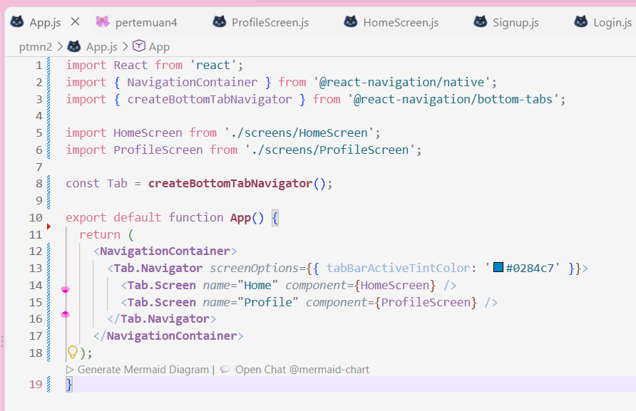


---

## E. PRAKTIKUM 3: Drawer Navigation

Drawer menampilkan panel navigasi samping (sidebar) yang dapat digeser atau dibuka melalui ikon Hamburger.

### Langkah 1: Instalasi Pustaka Drawer

```sh
npm install @react-navigation/drawer
# Pastikan juga plugin reanimated sudah terinstall dan dikonfigurasi di babel.config.js jika diperlukan

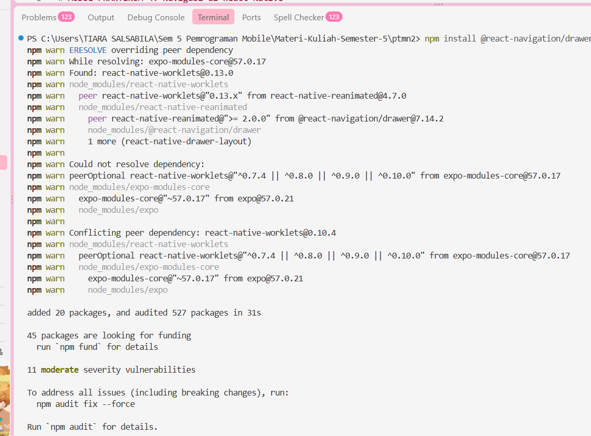
```

### Langkah 2: Konfigurasi Drawer di `App.js`

Ubah kembali file `App.js` untuk mencoba Drawer Navigation menggunakan layar Home dan Profile yang sudah dibuat sebelumnya:

```js
import React from 'react';
import { NavigationContainer } from '@react-navigation/native';
import { createDrawerNavigator } from '@react-navigation/drawer';

import HomeScreen from './screens/HomeScreen';
import ProfileScreen from './screens/ProfileScreen';

const Drawer = createDrawerNavigator();

export default function App() {
  return (
    <NavigationContainer>
      <Drawer.Navigator initialRouteName="Home">
        <Drawer.Screen name="Home" component={HomeScreen} options={{ drawerLabel: 'Beranda' }} />
        <Drawer.Screen name="Profile" component={ProfileScreen} options={{ drawerLabel: 'Profil Pengguna' }} />
      </Drawer.Navigator>
    </NavigationContainer>
  );
}
```


**Catatan Penting:** Geser layar dari kiri ke kanan pada emulator Anda untuk memunculkan menu Drawer.

---

## F. Tugas Praktikum

Sebagai latihan pemahaman logika *nested navigation* (navigasi bersarang), kerjakan tugas berikut:

1. Diskusi bersama teman kelompok Anda untuk merancang alur navigasi aplikasi Project Base Test (UTS dan UAS) yang menggabungkan **Stack Navigation** dan **Tab Navigation** serta **Drawer Navigation**.  
2. Kumpulkan kode sumber (dapat di-push ke GitHub) beserta  *screenshot*  hasil eksekusi aplikasinya.